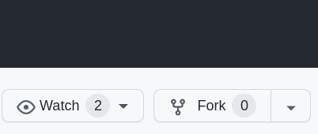
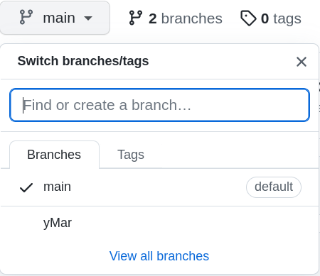
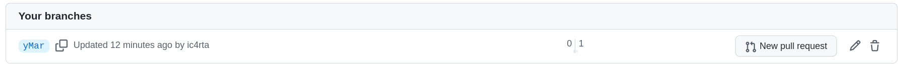
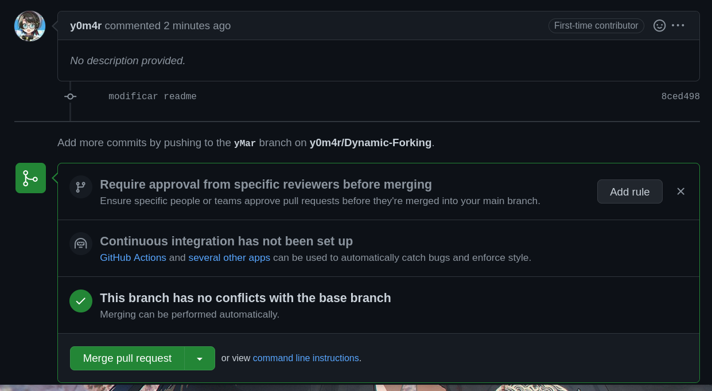

# Pasos para hacer fork y pull request

### Usuarios

- ic4rta (usuario con el repositorio original)
- y0m4r (usuario que mandara una PR a ic4rta para modificar el repo original)

**1.Desde el github, y0m4r hara un fork al repositorio original (ej. <https://github.com/ic4rta/Dynamic-Forking>)**



Esto creara una copia exacta del repositorio original

**2.El usuario y0m4r clonara el repositorio al que hizo fork**

```git clone https://github.com/y0m4r/Dynamic-Forking.git```

**3.Renombrar la entrada remota del repositorio de y0m4r**

```
git remote rename origin forking
                    ^       ^
                nombre de   |---- Nombre de la 
                la entrada        nueva entrada
                original          remota
```

Ahora ya esta configurada la nueva entrada remota
```git remote -v```

```
forking	https://github.com/y0m4r/Dynamic-Forking.git (fetch)
forking	https://github.com/y0m4r/Dynamic-Forking.git (push)
```

**4.Enlazar con repositorio original**

```git remote add origin https://github.com/ic4rta/Dynamic-Forking```

Ahora y0m4r esta enlazando con los dos repositorios (origin y fork)

```
forking	https://github.com/y0m4r/Dynamic-Forking.git (fetch)
forking	https://github.com/y0m4r/Dynamic-Forking.git (push)
origin	https://github.com/ic4rta/Dynamic-Forking (fetch)
origin	https://github.com/ic4rta/Dynamic-Forking (push)

forking: remoto del usuario y0m4r
origin: remoto del usuario con el repo original (ic4rta)
```

**5.Crear una rama para trabajar en ella** 

```git checkout -b "yMar"```

Con este comando se creo una nueva rama llamada "yMar" y nos movimos a ella

Ahora puedes hacer realizar los cambios a los archivos del repositorios

**6. Subir los cambios**

```git add README.md``` 
(en mi caso hare un commit de ese por que ese modifique)

```git commit -m "modificar readme"```

**7. Enviar los cambios al repositorio original**

- **Enviar la rama creada del fork de y0m4r**
    - ```git push forking yMar``` 
    lo que hara es enviar los cambios hechos en la rama "yMar" al remoto forking, que corresponde al remoto de y0m4r

    
    
    Ahora se agrego una nueva rama que contiene los cambios que hicimos


- **Solicitar cambios**
    - Se le da click en la palabra ```branches```
    y click en "New Pull request"

    

    *A tomar en cuenta*

    

    - Base repository: repositorio original
    - base: rama donde se aplicaran los cambios (por defecto main)
    - head repository: repositorio donde estan los cambios a enviar (el del usuario y0m4r)
    - compare: rama que tiene los cambios a enviar

    Ahora se le da click en el boton que dice "create pull request"


- **Del lado del perfil del usuario original llego una notificacion con el pull request**



Ahora se le da click en "Merge pull request".
Ahora el repositorio original al contiene los cambios solicitados por y0m4r :)

**7. Actualizar el fork con los cambios hechos en el repositorio original**

- Cambiar a la rama main
    ```git switch main```

- Hacer pull para traer los cambios del repo original
    ```git pull origin main```

- Enviar commits al fork de y0m4r 
    ```git push forking main```

- Eliminar la rama "yMar" desde donde se hicieron todos los cambios

    ```git branch -d yMar```

- Eliminar la rama del repositorio remoto
    ```git push mifei --delete yMar```


*Si se desea hacer otro PR no hace falta renombrar ni enlazar las entradas remotas, desde ahora se empieza desde el paso 5*

**Eso es todo** :monkey:
